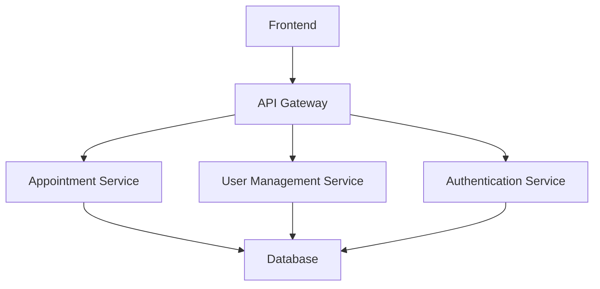

# care-compass

ER Diagram 
 link: https://drive.google.com/file/d/1ndBOs5qsHX70zR0v7FLuskbXd1rmTBbM/view?usp=drive_link


Project Title
Simple overview of use/purpose.

Description
An in-depth paragraph about your project and overview of use.

Getting Started
Dependencies
Describe any prerequisites, libraries, OS version, etc., needed before installing program.
ex. Windows 10
Installing
How/where to download your program
Any modifications needed to be made to files/folders
Executing program
How to run the program
Step-by-step bullets
code blocks for commands
Help
Any advise for common problems or issues.

command to run if program contains helper info
Authors
Contributors names and contact info

ex. Dominique Pizzie
ex. @DomPizzie

Version History
0.2
Various bug fixes and optimizations
See commit change or See release history
0.1
Initial Release
License
This project is licensed under the Apache-2.0 License - see the LICENSE.


# HealthBridge 🏥

## Overview
HealthBridge is an open-source healthcare management platform designed to streamline medical appointments, patient management, and healthcare provider coordination.

### Key Features
- 🩺 Doctor Appointment Booking
- 📋 Patient Management
- 🏥 Hospital/Provider Network
- 🔐 Secure User Authentication

### Tech Stack
- Backend: Node.js, TypeScript
- Database: PostgreSQL
- ORM: Sequelize
- Authentication: JWT
- Containerization: Docker

## Quick Start

### Prerequisites
- Node.js (v18+)
- PostgreSQL (v13+)
- Docker (optional)

### Installation
```bash
# Clone the repository
git clone https://github.com/your-org/healthbridge.git

# Navigate to project directory
cd healthbridge

# Install dependencies
npm install

# Setup environment variables
cp .env.example .env

# Run database migrations
npm run migrate

# Start development server
npm run dev
```

## Contributing Guidelines
[Link to CONTRIBUTING.md]


# Contributing to HealthBridge

## Welcome Contributors! 🌟

We're thrilled that you're interested in contributing to HealthBridge. This document provides guidelines for contributing to our project.

### Code of Conduct
- Be respectful
- Be inclusive
- Collaborate constructively

### How to Contribute

#### 1. Development Setup
1. Fork the repository
2. Clone your forked repository
3. Create a new branch:
```bash
git checkout -b feature/your-feature-name
```

#### 2. Development Workflow
- Ensure code follows our style guide
- Write unit tests for new features
- Run linters and formatters
```bash
npm run lint
npm run test
```

#### 3. Commit Guidelines
- Use conventional commits
- Prefix commits with type:
  - `feat:` New feature
  - `fix:` Bug fix
  - `docs:` Documentation changes
  - `refactor:` Code refactoring
  - `test:` Adding tests
  - `chore:` Maintenance tasks

Example:
```bash
git commit -m "feat: add patient appointment booking feature"
```

#### 4. Pull Request Process
1. Ensure all tests pass
2. Update documentation if needed
3. Provide a clear PR description
4. Link any related issues

### Reporting Issues
- Use GitHub Issues
- Provide detailed information
- Include:
  - Steps to reproduce
  - Expected behavior
  - Actual behavior
  - Environment details

### Development Environment

#### Required Tools
- Node.js v18+
- PostgreSQL v13+
- Docker (recommended)
- VSCode or similar IDE

#### Recommended Extensions
- ESLint
- Prettier
- TypeScript intellisense

### Security Reporting
For security vulnerabilities, please email security@healthbridge.org

# HealthBridge Architecture

## High-Level Architecture


## Microservices Overview
1. **Authentication Service**
   - Handles user registration
   - Manages JWT tokens
   - Implements role-based access control

2. **Appointment Service**
   - Manages doctor-patient appointments
   - Handles scheduling logic
   - Implements reminder systems

3. **User Management Service**
   - Manages patient and doctor profiles
   - Handles user data updates

## Database Schema
[Link to database schema documentation]

## API Documentation
[Link to Swagger/OpenAPI documentation]


# Contributor Covenant Code of Conduct

## Our Pledge
We are committed to providing a friendly, safe, and welcoming environment for all contributors.

## Expected Behavior
- Be respectful and inclusive
- Be patient with others
- Provide constructive feedback
- Collaborate openly

## Unacceptable Behavior
- Harassment
- Discriminatory language
- Trolling
- Personal attacks

## Enforcement
Violations can result in:
- Verbal warning
- Temporary or permanent ban from the project


# Security Policy

## Supported Versions
| Version | Supported          |
|---------|-------------------|
| 1.0.x   | :white_check_mark:|
| < 1.0   | :x:               |

## Reporting a Vulnerability
1. Email: security@healthbridge.org
2. Encrypt communication if possible
3. Provide detailed information about the vulnerability

## Security Best Practices
- Never commit sensitive information
- Use environment variables
- Implement proper authentication
- Regular dependency updates


